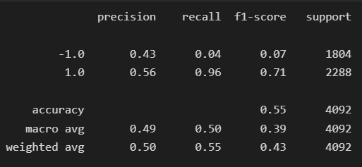

# ML Trading Bot | Evaluation Report

### Original/Provided Baseline Algorithm: 

`The provided SVM model generated an accuracy score of 55% and a high recall score (96%) when buying but a low recall score (4%) when selling. This indicates the model performs extremely well when determining when to enter a position. `

`The model used actual returns from 2018 to 2021 and could be improved by increasing the timeframe. `

 

### Tuned Baseline Algorithm: 

`Adjusted the Size of Training Data: Increasing the training window to 6 months did impact the results significantly `
* The cumulative return plot shows a little less volatility in prices during the years 2019-2020, compared to the original model results. 
* Accuracy score increased slightly 

    (original model --> 55%, tuned size of training dataset model: 56%)

`Adjusted the SMA input features: Increasing the short SMA window to 8 and decreasing the long SMA window to 20 months impacted the results a little bit`
* The strategy returns are a bit closer to the actual returns compared to the provided baseline model, indicating the model is learning and predicting quite accurately.
    
* Accuracy score remained the same as the original model, however the recall for selling (-1) increased indicating the tuned model will learn to predict when to sell a little better.

`The tuned model was able to use more actual returns from 2016 to 2021 indicating that the model is learning off of more data. `

 

### Multi-layer Perceptron (MLP) Algorithm: 

---
